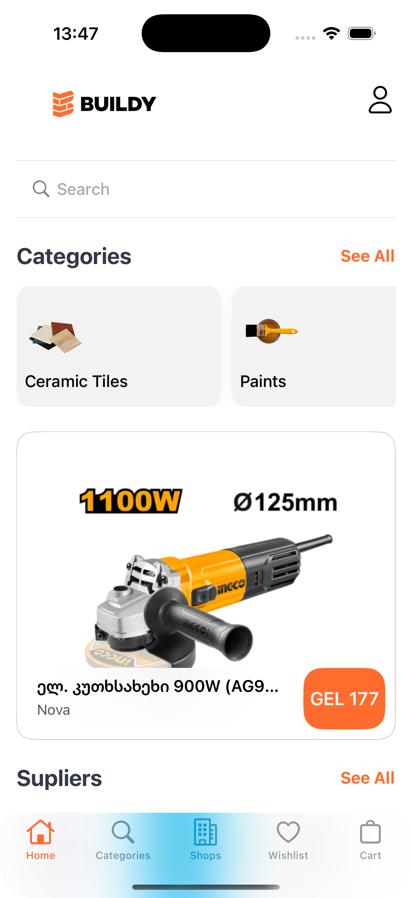
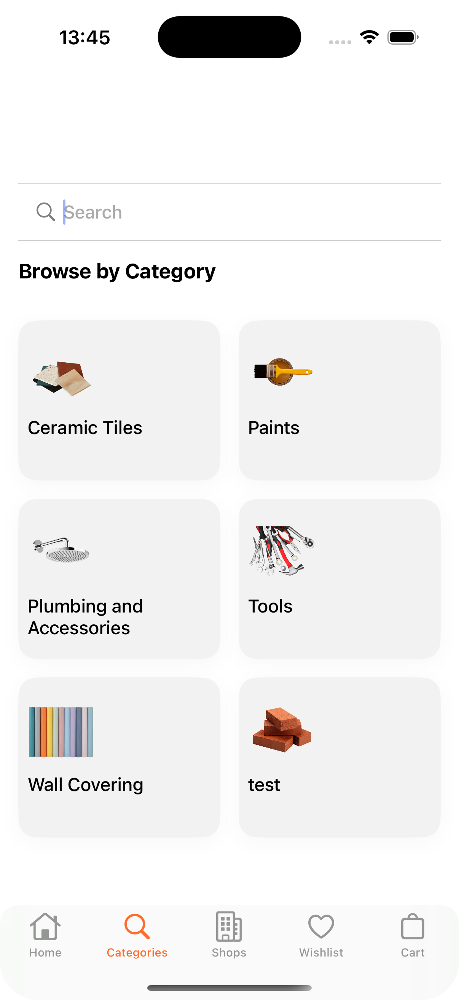
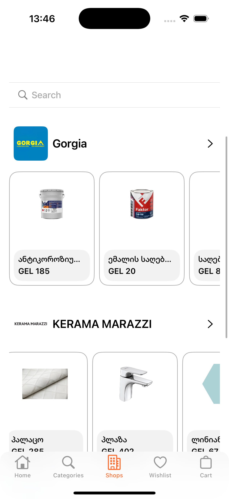
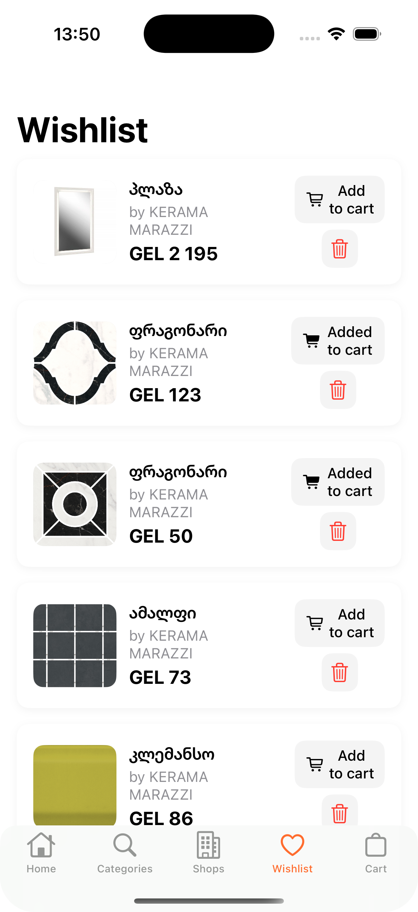
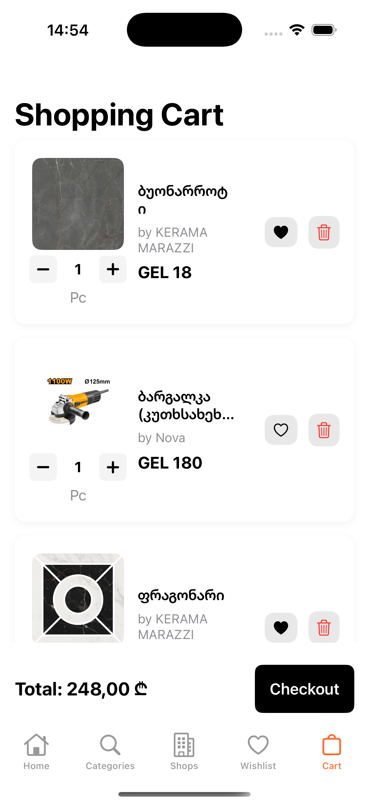

<!-- PROJECT LOGO -->
<br />
<div align="center">  <h3 align="center">BUILDY</h3> <p align="center"> A building materials delivery application that connects multiple construction stores in one platform. </p> </div>


## Introduction
`BUILDY`  is a powerful building materials delivery application that allows users to browse and purchase construction products from multiple suppliers. The app fetches product data from a Google Sheet, which is synchronized with Firebase Realtime Database using Google Apps Script.


## 🚀 Features

🟠 **Browse Products by Category** – Easily navigate and find construction materials.  
🏪 **Multi-Store Listings** – View and compare products from multiple construction stores in one place.  
🧡 **Wishlist & Cart** – Authorized users can save favorite products and manage their cart.  
🔐 **Secure Authentication** – Sign in using Email/Password or Google Authentication.  
👷‍♀️ **Guest Mode** – Browse products without needing to log in.  
✴️ **Fast Product Search** – Quickly find materials with Firebase-powered search.  


| Home | Categories | Shops | Add to Wishlist | Add to Cart |
| --- | --- | --- | --- | --- |
|  |   |  |  |  |

<!-- ABOUT THE PROJECT -->
## About The Project

BUILDY is designed to simplify the purchase of construction materials by bringing multiple suppliers under one app. It enables users to compare and order materials seamlessly, ensuring convenience for builders, contractors, and homeowners.

Why Use BUILDY?

✔ All-in-One Solution – Browse, compare, and order materials in one app.

✔ Fast & Secure – Firebase-powered authentication and database.

✔ Guest & Authorized Access – Try the app without logging in.


### Built With


* Swift (UIKit & SwiftUI)
* Firebase Realtime Database
* Firebase Firestore
* Firebase Authentication (Email & Google Sign-In)
* Google Apps Script (Google Sheets Integration)


<!-- GETTING STARTED -->
## 🚀 Getting Started

Before installing, make sure you have the following:  
🔸 **Xcode 15+** (Required to run the project)  
🔸 **Firebase Configuration** (Ensure Firebase setup is complete)  

### 🛠 Installation

1️⃣ **Clone the Repository**  
   ```sh
   git clone https://github.com/ninikurshavishvili/BUILDY.git
   ```

## Usage

1. **Guest Browsing**  
   - Explore construction materials and products without an account.  
   - View product details, categories, and store listings.  

2. **User Authentication**  
   - Sign in or register using **Email/Password** or **Google Sign-In**.  
   - Access additional features like Wishlist, Cart, and Order Placement.  

3. **Product Search & Categories**  
   - Search for specific building materials using the integrated search bar.  
   - Browse products categorized by type and supplier.  

4. **Wishlist & Cart Management**  
   - Save products to your Wishlist for future reference.  
   - Add items to the Cart and manage quantities before checkout.  

5. **Order Placement & Tracking**  
   - Place an order directly from the Cart.  
 


<!-- ROADMAP -->
## Roadmap

### Completed Features  
- [x] **Guest Mode Access** – Browse products without logging in.  
- [x] **Wishlist & Cart Functionality** – Save products and manage cart items.  
- [x] **Multi-store Product Listings** – View products from multiple construction stores in one place.  
- [x] **Product Search & Filtering** – Quickly find products by category and name.  
- [x] **User Authentication** – Sign in with Email/Password or Google.  
- [x] **Order Placement & Tracking** – Place orders and track deliveries with driver details.  
- [x] **Firestore & Firebase Integration** – Sync user data, products, and orders seamlessly.  

### Upcoming Features  
- [ ] **Multi-language Support**  
    - [x] Georgian  
    - [ ] English  
- [ ] **Push Notifications** – Notify users about order updates and promotions.  
- [ ] **Improved Order Tracking** – Enhance delivery tracking with real-time map updates.  
- [ ] **Dark Mode Support** – Provide a dark mode option for better user experience.  

---

## Contact  

For any questions, feedback, or contributions, feel free to reach out:  

- **Developer:** Nini Kurshavishvili  
- **Email:** [ninikurshavishvili606@gmail.com](ninikurshavishvili606@gmail.com)  
- **GitHub:** [ninikurshavishvili](https://github.com/ninikurshavishvili)  
- **Project Repository:** [BUILDY on GitHub](https://github.com/ninikurshavishvili/BUILDY)  
